# 🤖 RAG-Based Data Analysis & Question-Answering Platform

<div align="center">


**Herhangi bir CSV veri seti üzerinde doğal dil ile sorgulama yapabilen AI-powered analiz platformu**

[🚀 Demo](#-demo) • [✨ Özellikler](#-özellikler) • [📦 Kurulum](#-kurulum) • [📖 Kullanım](#-kullanım) • [🛠️ Teknolojiler](#️-teknoloji-stack)

---

## 🎬 Video Demo

<div align="center">

[](https://www.loom.com/share/e65aefd5ad88412eb6cb63b6e0a72c82?sid=ef5d2676-17bd-486a-bab3-c237cbbe3d76)

**🎥 Projenin tam özellik tanıtımı**

*CSV yükleme, veri analizi, chatbot kullanımı ve AI-powered görselleştirmeler*

[▶️ Loom'da İzle](https://www.loom.com/share/e65aefd5ad88412eb6cb63b6e0a72c82?sid=ef5d2676-17bd-486a-bab3-c237cbbe3d76)

</div>

---

</div>

## 📸 Proje Görselleri

<div align="center">

### 🏠 Ana Sayfa - Veri Yükleme
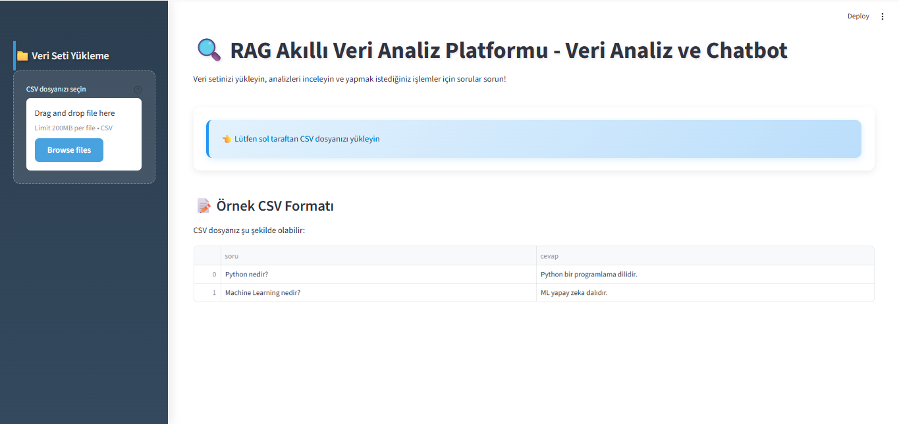

*CSV dosyası yükleme ve veri seti önizleme*

---

### 📊 Veri Seti Bilgileri
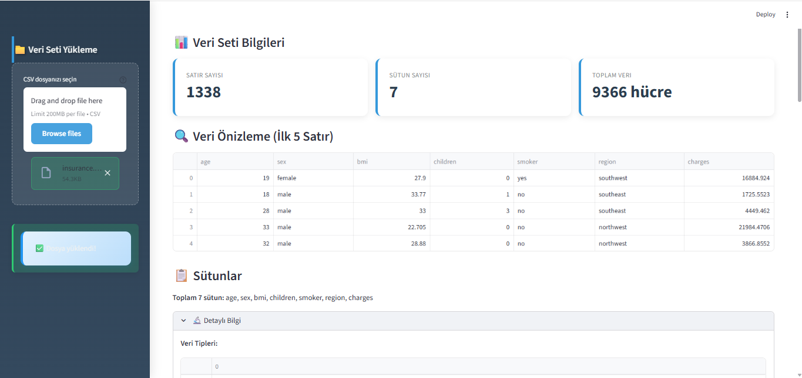

*Otomatik veri analizi ve istatistiksel özet*

---

### 📈 İstatistiksel Analiz
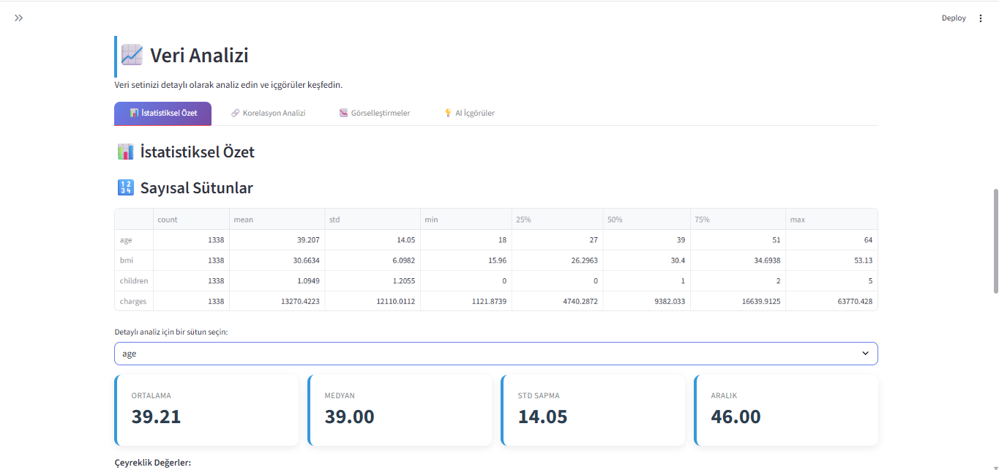

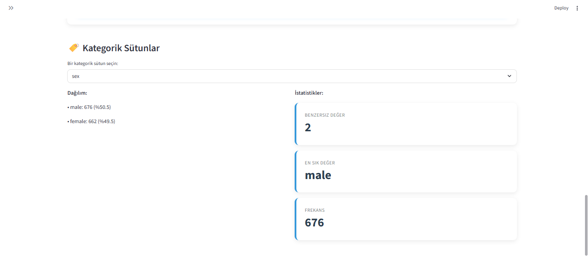

*Detaylı istatistiksel analiz ve veri dağılımları*

---

### 🔗 Korelasyon Analizi
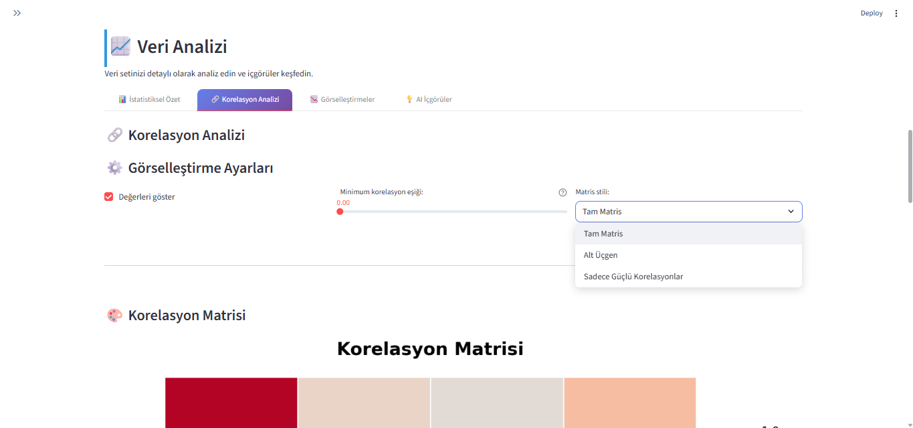

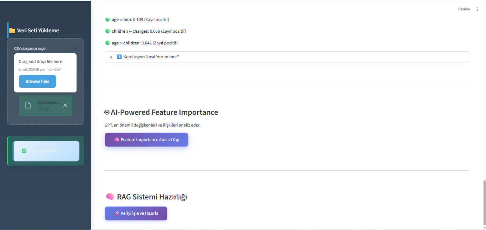

*Değişkenler arası ilişki analizi ve heatmap*

---

### 📉 Görselleştirmeler
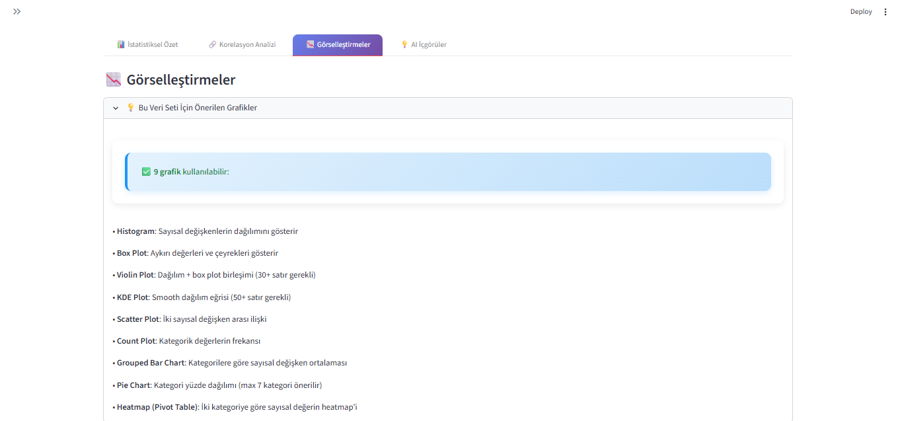

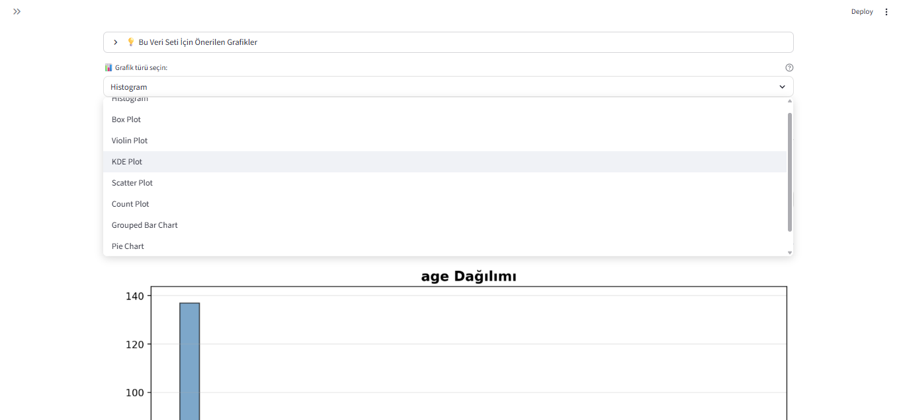

*10+ farklı grafik türü ile veri görselleştirme*

---

### 💬 Chatbot Arayüzü


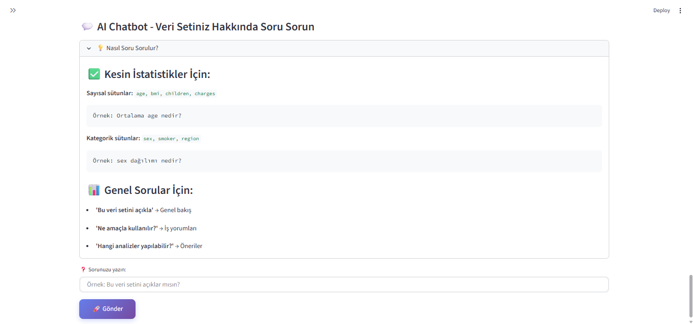

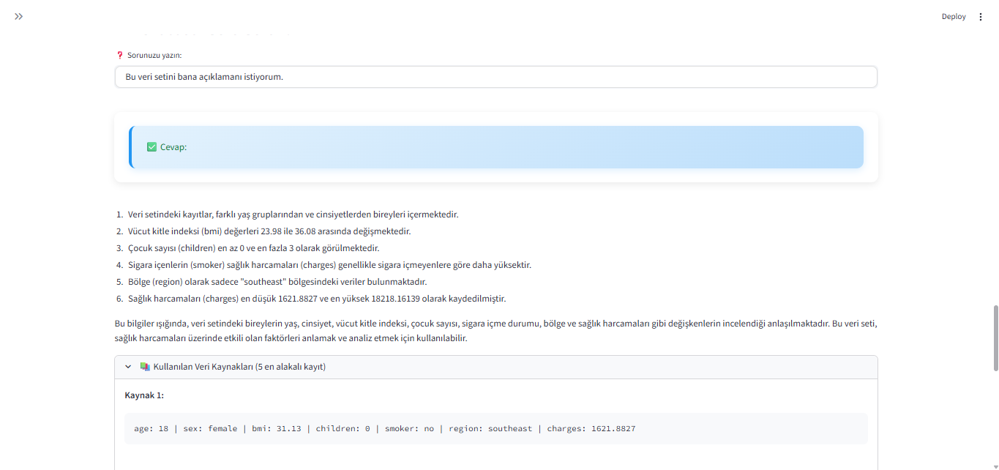

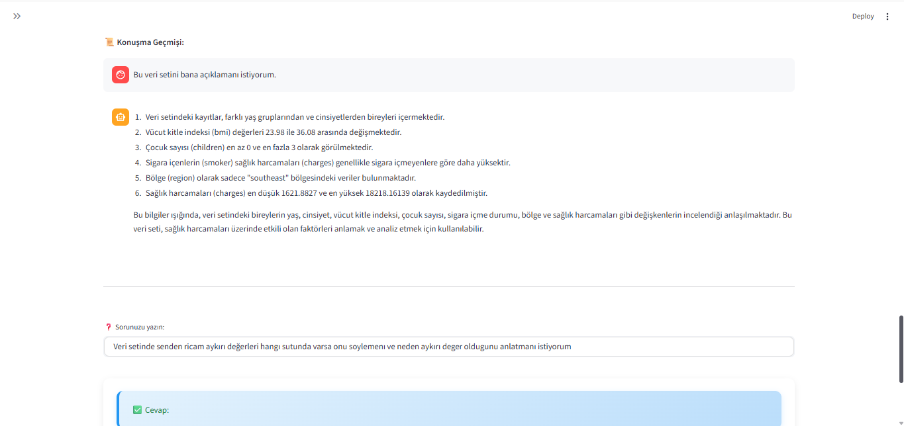

*Doğal dil ile veri sorgulama ve AI-powered cevaplar*

---

### 🤖 AI İçgörüler


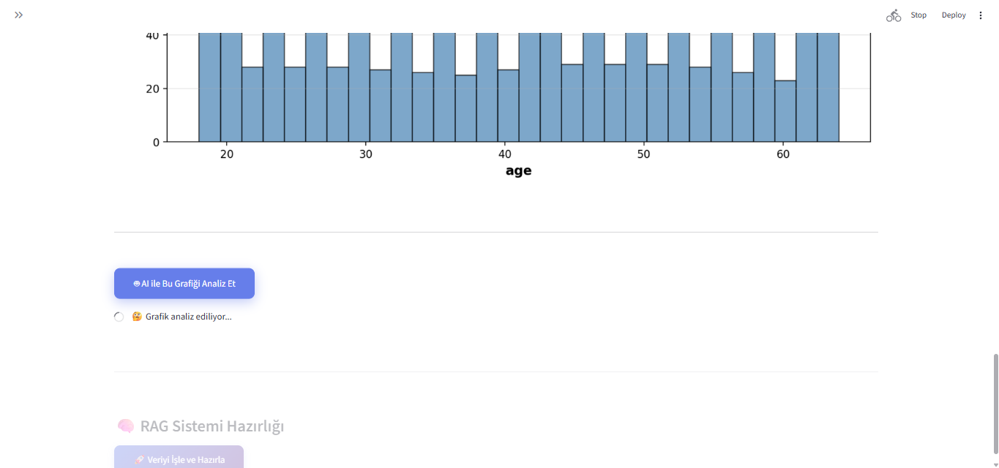

*GPT-powered grafik yorumlama ve otomatik içgörüler*

</div>

---

## 📌 Proje Hakkında

Bu proje, **Retrieval-Augmented Generation (RAG)** mimarisi kullanarak CSV veri setleri üzerinde akıllı analiz ve sorgulama yapabilen bir platformdur. Kullanıcılar veri setlerini yükleyerek:

- 🔍 **Semantic search** ile anlamsal arama yapabilir
- 💬 **Doğal dil** ile verilerine soru sorabilir
- 📊 **Otomatik analiz** ve görselleştirme alabilir
- 🤖 **AI-powered insights** ile veri içgörüleri elde edebilir

**Kullanım Alanları:**
- İş analitiği ve raporlama
- Veri keşfi (Exploratory Data Analysis)
- Hızlı veri sorgulama ve filtreleme
- Akademik araştırma ve veri analizi

---

## ✨ Özellikler

### 🎯 Temel Özellikler
- **📂 CSV Yükleme**: Herhangi bir CSV dosyasını yükleyin ve anında analiz edin
- **🔍 RAG Architecture**: Retrieval-Augmented Generation ile semantic search
- **💬 Doğal Dil Sorguları**: "En çok kazanan müşteri kim?" gibi sorular sorun
- **🧠 Context-Aware Responses**: Önceki konuşmaları hatırlayan akıllı chatbot

### 📊 Veri Analizi
- **İstatistiksel Özet**: Otomatik EDA (Exploratory Data Analysis)
- **Korelasyon Analizi**: Değişkenler arası ilişkileri keşfedin
- **10+ Görselleştirme**: Histogram, box plot, scatter plot, heatmap, distribution analysis
- **Missing Value Analysis**: Eksik veri tespiti ve görselleştirme

### 🤖 AI-Powered Özellikler
- **GPT-3.5-turbo Entegrasyonu**: Akıllı cevap üretimi
- **Grafik Yorumlama**: AI ile otomatik grafik analizi
- **Insight Generation**: Veri içgörüleri ve öneriler
- **Custom Embeddings**: Sentence Transformers ile vektör oluşturma

### 🎨 Modern UI/UX
- **Responsive Tasarım**: Modern glassmorphism dark theme
- **Custom CSS**: Profesyonel ve şık görünüm
- **Interactive Charts**: Plotly ile interaktif grafikler
- **Real-time Updates**: Anlık veri güncellemeleri

---

## 🛠️ Teknoloji Stack

### Backend & AI
| Teknoloji | Kullanım Amacı |
|-----------|----------------|
| **Python 3.9+** | Ana programlama dili |
| **OpenAI GPT-3.5-turbo** | Doğal dil işleme ve cevap üretimi |
| **Sentence Transformers** | Text embedding (all-MiniLM-L6-v2) |
| **ChromaDB** | Vector database - semantic search |
| **LangChain** | RAG pipeline yönetimi |

### Data Processing & Visualization
| Teknoloji | Kullanım Amacı |
|-----------|----------------|
| **Pandas** | Veri manipülasyonu |
| **NumPy** | Sayısal işlemler |
| **Plotly** | İnteraktif görselleştirme |
| **Matplotlib & Seaborn** | İstatistiksel grafikler |

### Frontend & Deployment
| Teknoloji | Kullanım Amacı |
|-----------|----------------|
| **Streamlit** | Web arayüzü framework |
| **Custom CSS** | Modern UI/UX tasarımı |

---

## 📦 Kurulum

### Gereksinimler
- Python 3.9 veya üzeri
- OpenAI API Key
- 2GB+ RAM (önerilen)

### Adım 1: Projeyi Klonlayın

```bash
git clone https://github.com/alicansah1n/rag-chatbot.git
cd rag-chatbot
```

### Adım 2: Virtual Environment Oluşturun

**Linux/Mac:**
```bash
python -m venv .venv
source .venv/bin/activate
```

**Windows:**
```bash
python -m venv .venv
.venv\Scripts\activate
```

### Adım 3: Bağımlılıkları Yükleyin

```bash
pip install -r requirements.txt
```

### Adım 4: Environment Variables Ayarlayın

Proje kök dizininde `.env` dosyası oluşturun:

```env
OPENAI_API_KEY=your_openai_api_key_here
```

⚠️ **ÖNEMLİ:** `.gitignore` dosyasında `.env` bulunduğundan emin olun.

### Adım 5: Uygulamayı Çalıştırın

```bash
streamlit run app.py
```

Tarayıcınızda otomatik olarak `http://localhost:8501` açılacaktır.

---

## 📖 Kullanım

### 1️⃣ Veri Yükleme
- Sidebar'dan **"CSV dosyanızı seçin"** butonuna tıklayın
- Maksimum 200MB boyutunda CSV dosyası yükleyebilirsiniz
- Desteklenen format: UTF-8 encoded CSV

### 2️⃣ Veri Önizleme ve Analiz
- Yüklenen veri otomatik olarak analiz edilir
- **Veri Seti Bilgileri**: Satır/sütun sayısı, veri tipleri
- **İstatistiksel Özet**: Mean, median, std, min/max değerler
- **İlk 5 Satır**: Veri önizleme

### 3️⃣ Veri İşleme (RAG Pipeline)
- **"Veriyi İşle ve Chatbot'u Başlat"** butonuna tıklayın
- Veriler vektörlere dönüştürülür (embedding)
- ChromaDB'ye kaydedilir
- Chatbot kullanıma hazır hale gelir

### 4️⃣ Chatbot ile Sorgulama

**Örnek Sorular:**
```
"En yüksek satış yapan müşteri kim?"
"Yaş ortalaması nedir?"
"Kadın müşterilerin toplam harcaması ne kadar?"
"Hangi kategoride en çok satış var?"
```

### 5️⃣ Veri Analizi Sekmeleri

#### 📊 İstatistiksel Özet
- Sayısal değişkenler için describe() çıktısı
- Kategorik değişkenler için frekans tabloları

#### 🔗 Korelasyon Analizi
- Pearson korelasyon matrisi
- Interaktif heatmap görselleştirmesi

#### 📈 Görselleştirmeler
10+ farklı grafik türü:
- Histogram, Box Plot, Scatter Plot
- Scatter Matrix, Distribution Plot
- Pair Plot, Violin Plot, vb.

#### 💡 AI İçgörüler
- GPT-powered grafik yorumları
- Otomatik pattern detection
- Actionable insights

---

## 📁 Proje Yapısı

```
rag-chatbot/
├── 📄 app.py                    # Ana uygulama dosyası
├── 📁 config/
│   └── settings.py              # Konfigürasyon ayarları
├── 📁 utils/
│   ├── data_loader.py           # CSV yükleme ve validasyon
│   ├── embeddings.py            # Text embedding işlemleri
│   ├── vector_store.py          # ChromaDB yönetimi
│   └── llm_handler.py           # OpenAI API entegrasyonu
├── 📁 components/
│   ├── sidebar.py               # Sidebar komponenti
│   ├── data_preview.py          # Veri önizleme
│   ├── analysis.py              # İstatistiksel analiz
│   ├── rag_processor.py         # RAG pipeline
│   └── chatbot.py               # Chat arayüzü
├── 📁 styles/
│   └── custom.css               # Özel CSS tasarımı
├── 📄 requirements.txt          # Python bağımlılıkları
├── 📄 .env.example              # Environment variables örneği
├── 📄 .gitignore                # Git ignore kuralları
└── 📄 README.md                 # Proje dokümantasyonu
```

---

## 🎨 Özelleştirme

### Model Ayarları

`config/settings.py` dosyasından değiştirebilirsiniz:

```python
# LLM Ayarları
LLM_MODEL = "gpt-3.5-turbo"
LLM_TEMPERATURE = 0.3          # 0 (robotik) - 1 (yaratıcı)
LLM_MAX_TOKENS = 800           # Maksimum cevap uzunluğu

# RAG Ayarları
TOP_K_RESULTS = 5              # Semantic search sonuç sayısı
BATCH_SIZE = 100               # Veri işleme batch boyutu
```

### CSS Tema Değiştirme

`styles/custom.css` dosyasından renk ve tasarımı özelleştirebilirsiniz.

---

## 🔒 Güvenlik

- ✅ API key'ler `.env` dosyasında saklanır
- ✅ `.gitignore` ile hassas dosyalar korunur
- ✅ Environment variables ile güvenli deployment
- ⚠️ API key'i asla kod içine yazmayın
- ⚠️ `.env` dosyasını GitHub'a pushlamayın

---

## 🐛 Sorun Giderme

### Sık Karşılaşılan Hatalar

**1. ModuleNotFoundError**
```bash
pip install -r requirements.txt
```

**2. OpenAI API Error**
- `.env` dosyasında `OPENAI_API_KEY` doğru mu kontrol edin
- API key'inizin aktif ve kredisi olduğundan emin olun

**3. ChromaDB Error**
```bash
pip install --upgrade chromadb
```

**4. Encoding Hatası (CSV)**
- CSV dosyanızın UTF-8 encoded olduğundan emin olun
- Excel'de: "Save As" → "CSV UTF-8"


## 👤 Yazar

**Ali Can Şahin**

- 🌐 GitHub: [@alicansah1n](https://github.com/alicansah1n)
- 💼 LinkedIn: [linkedin.com/in/alicansahinn](https://linkedin.com/in/alicansahinn)
- 📧 Email: alican.sahin.tr@gmail.com

---
## 🙏 Okuduğunuz için Teşekkür Ederim..
---

<div align="center">

**⭐ Projeyi beğendiyseniz yıldız vermeyi unutmayın!**

</div>
